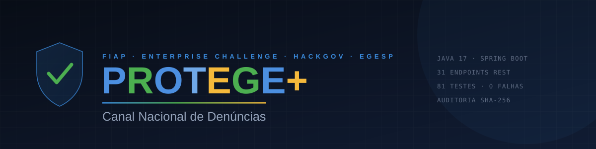

<div align="center">



<br>

[](https://openjdk.org/projects/jdk/17/)
[](https://spring.io/projects/spring-boot)
[](#segurança-e-privacidade)
[](database/01_ddl_oracle.sql)
[](#1-backend-api-java)
[](formulario-react.html)

[](#testes)
[](#endpoints)
[](#auditoria)
[](#segurança-e-privacidade)
[](#funcionalidades)

<br>

[](https://gabriell230g.github.io/hackgovProtegeMais/)
[](https://youtu.be/SUBSTITUIR-PELO-LINK)
[](docs/Protege_Mais_Fase5_Documento.pdf)
[](docs/Protege_Mais_EC_Atividade4_Apresentacao.pdf)

</div>

<br>

> ### 🕑 Para avaliar em dois minutos
>
> O site publicado roda **sem servidor**, então mostra apenas 5 denúncias de demonstração e exibe a etiqueta `modo local`.
> Para ver o produto completo, com as **125 denúncias**, o relatório estatístico e a trilha de auditoria, suba o backend
> seguindo a seção [Como executar](#-como-executar). São dois comandos e menos de cinco minutos.
>
> O documento técnico completo e as apresentações estão em [`docs/`](docs/).

<br>

Plataforma para registro e gestão de denúncias de violência, abuso e violação de direitos, com **canal anônimo para o cidadão** e **painel inteligente para o gestor público**: Kanban, equipe, mapa com k-anonimato, relatório estatístico, trilha de auditoria e o copiloto de IA **VigIA**.

Desenvolvido para o **Enterprise Challenge FIAP / HackGov**, em parceria com a **EGESP**. Este repositório é a entrega de código da **Fase 5** da disciplina e da **Atividade 4** do Enterprise Challenge.

<table>
<tr>
<td width="50%" valign="top">

#### 🛡️ Lado do cidadão

Denunciar sem se expor.

- Três níveis de anonimato, do total ao identificado
- Protocolo e código seguro para acompanhar
- Evidência em arquivo ou relato em áudio
- Fluxo de emergência com geolocalização
- Saída imediata, **Modo Seguro**, PT/EN e VLibras

</td>
<td width="50%" valign="top">

#### 📊 Lado do órgão

Decidir com informação.

- Quatro perfis com permissões distintas
- Kanban, fila de priorização e ações reversíveis
- Mapa por município e relatório estatístico
- Trilha de auditoria com verificação de integridade
- **VigIA**, que lê o acervo e recomenda ação

</td>
</tr>
</table>

<div align="center">

| Back-end | Testes | Banco | Front-end | Base de demonstração |
|:---:|:---:|:---:|:---:|:---:|
| **63 + 11** classes Java | **81** testes, 0 falhas | **12** tabelas · **30** CHECK | **27** módulos JS · **7** CSS | **125** denúncias determinísticas |

</div>

---

## 🚀 Como executar

Você precisa apenas de um **JDK 17 ou superior**. O Maven é baixado automaticamente na primeira execução.

> 💡 Use **duas janelas de terminal**: uma para a API e outra para o servidor de arquivos. Se as duas forem a mesma janela, o segundo comando derruba o primeiro.

### 1. Backend (API Java)

```bash
cd backend
.\build.cmd clean test     # Windows, roda os 81 testes
.\build.cmd run            # sobe a API em http://localhost:8080
```

No Linux ou macOS, use o Maven diretamente:

```bash
cd backend
mvn clean test
mvn spring-boot:run
```

<details>
<summary>Gerar o executável</summary>

```bash
.\build.cmd clean package -DskipTests
java -jar target\protege-backend-1.0.0.jar
```

</details>

O banco padrão é o **H2 embutido**, criado automaticamente em `backend/data/`. Não exige instalação, serviço nem credencial, e é o que permite executar o projeto logo após descompactar.

| Recurso | Endereço |
|---|---|
| 📘 Documentação da API | <http://localhost:8080/swagger-ui.html> |
| 🗄️ Console do banco | <http://localhost:8080/h2-console> · JDBC `jdbc:h2:file:./data/protege` · usuário `sa`, sem senha |

### 2. Front-end (portal e painel)

Sirva por HTTP. Abrir o `index.html` com duplo clique faz o navegador bloquear as chamadas por CORS.

```bash
python -m http.server 5500
```

Acesse <http://localhost:5500>.

> ⚠️ **A porta importa.** A API aceita apenas `5500`, `5501`, `3000` e `8080` em `localhost`. Em outra porta o navegador bloqueia por CORS. O Live Server do VS Code já usa a 5500.

O front detecta o backend sozinho: se a API estiver no ar, usa o banco; se não, cai para o `localStorage`. O modo ativo não fica implícito, a **etiqueta de conexão** no alto da barra lateral mostra `API conectada` ou `modo local` e é clicável para verificar de novo. Quem decide olhando aquela tela precisa saber se os números vêm do banco ou só daquele navegador.

Duas telas consomem a mesma API para efeito de comparação: `index.html` (JavaScript puro) e `formulario-react.html` (**React 18 via CDN**, sem etapa de build). O bloco *"Versão em React deste formulário"*, logo abaixo do formulário, leva de uma à outra.

### 3. IA (VigIA com Gemini), opcional

```bash
export GEMINI_API_KEY="sua_chave"     # $env:GEMINI_API_KEY no Windows
```

Sem a chave, o VigIA continua funcionando por regras explicáveis. Cada análise declara sua origem (`GEMINI` ou `REGRAS`), para que a decisão automatizada seja auditável.

---

## 👥 Usuários de demonstração

Criados automaticamente na primeira execução. Existem quatro para que a **segregação de acesso possa ser verificada**, e não apenas descrita.

| | E-mail | Senha | Perfil | Vê identificação | Vê auditoria |
|:---:|---|---|---|:---:|:---:|
| 🔑 | `admin@protege.gov.br` | `admin123` | ADMIN | ✅ | ✅ |
| 🏛️ | `gestor@protege.gov.br` | `gestor123` | GESTOR | ✅ | ❌ |
| 👁️ | `atendente@protege.gov.br` | `atendente123` | ATENDENTE | ❌ | ❌ |
| 🔎 | `auditor@protege.gov.br` | `auditor123` | AUDITOR | ❌ | ✅ |

O gestor **não** consulta a trilha de auditoria: quem opera o sistema não fiscaliza o próprio uso dele.

---

## 🏗️ Arquitetura

| Camada | Tecnologia | Por quê |
|---|---|---|
| Front-end | HTML, CSS e JavaScript, React via CDN no formulário | Leve, sem build. Integra APIs públicas (IBGE para estados e cidades, OpenStreetMap para geolocalização) |
| Back-end | **Java 17 + Spring Boot 3.3.4** | Padrão de mercado para APIs corporativas e governamentais |
| Banco (demo) | **H2 embutido** | Zero instalação: o projeto roda ao ser descompactado |
| Banco (produção) | **PostgreSQL / Supabase**, modelo físico em **Oracle** | Scripts DDL, carga e consultas em `database/` |
| Segurança | Spring Security, JWT, BCrypt e RBAC | Perfis reais no token, CORS por lista de origens, limite de requisições por IP |
| Auditoria | Trilha encadeada por SHA-256 | Alteração em qualquer registro invalida a cadeia e é detectada |
| IA | Google Gemini com *fallback* por regras | Sem a chave, o sistema continua funcionando e explicando suas decisões |
| Documentação | Swagger / OpenAPI 3 | O botão *Authorize* permite executar as rotas protegidas pelo navegador |

---

## 🔌 Endpoints

São **31 mapeamentos**. **15** deles estão anotados com `@Auditavel` e alimentam a trilha, inclusive as tentativas recusadas.
🔒 indica que a rota exige o cabeçalho `Authorization: Bearer <token>`.

<details open>
<summary><b>Canal do cidadão, público</b></summary>

| Método | Rota | Descrição |
|---|---|---|
| `POST` | `/api/denuncias` | Registra denúncia. Devolve `201` com `Location`, protocolo, score e análise da IA |
| `GET` | `/api/denuncias/protocolo/{protocolo}` | Consulta o andamento. Não expõe relato nem endereço |
| `GET` | `/api/vigia/status` | Informa se a IA está em modo Gemini ou Regras |
| `POST` | `/api/auth/login` | Autentica o servidor e devolve o token JWT |

</details>

<details>
<summary><b>Painel do órgão</b></summary>

| Método | Rota | Perfil | Descrição |
|---|---|---|---|
| `GET` | `/api/denuncias` | 🔒 | Lista paginada com filtros de status, tipo e UF. **Sem relato e sem endereço** |
| `GET` | `/api/denuncias/{id}` | 🔒 | Detalhe do caso. Consulta sensível: gera auditoria |
| `PUT` | `/api/denuncias/{id}` | 🔒 | Atualiza os dados descritivos |
| `PATCH` | `/api/denuncias/{id}/status` | 🔒 | Muda o status e registra na linha do tempo |
| `PATCH` | `/api/denuncias/{id}/responsavel` | 🔒 | Atribui responsável |
| `DELETE` | `/api/denuncias/{id}?motivo=` | GESTOR, ADMIN | Exclusão lógica com anonimização. Exige motivo |
| `GET` | `/api/equipe` | 🔒 | Lista os membros que podem ser responsabilizados por um caso |
| `GET` | `/api/equipe/{id}` | 🔒 | Detalhe de um membro |
| `POST` | `/api/equipe` | GESTOR, ADMIN | Cadastra membro. `201` com `Location` |
| `PUT` | `/api/equipe/{id}` | GESTOR, ADMIN | Atualiza membro |
| `DELETE` | `/api/equipe/{id}` | GESTOR, ADMIN | Remove membro |
| `GET` | `/api/stats` | 🔒 | Totais por status, tipo, urgência e UF |
| `GET` | `/api/stats/analitico` | 🔒 | Relatório estatístico completo: medidas de posição e dispersão, quartis, outliers, assimetria, correlação e recortes por tipo, urgência e anonimato |

</details>

<details>
<summary><b>Evidências e exportação</b></summary>

| Método | Rota | Perfil | Descrição |
|---|---|---|---|
| `POST` | `/api/denuncias/protocolo/{p}/evidencias` | público | Anexa arquivo (`multipart`). **201** · **413** acima de 5 MB · **415** formato recusado · **429** limite por origem |
| `GET` | `/api/denuncias/{id}/evidencias` | 🔒 | Metadados dos anexos. Nunca o binário |
| `GET` | `/api/evidencias/{id}/arquivo` | 🔒 | Baixa o arquivo. **Consulta sensível: gera auditoria** |
| `DELETE` | `/api/evidencias/{id}?motivo=` | GESTOR, ADMIN | Remove o binário, mantém o registro. **204** |
| `GET` | `/api/exportacao/denuncias` | GESTOR, ADMIN | CSV auditado, sem o relato, com o mascaramento do perfil |

**O tipo de um arquivo enviado é determinado pela assinatura do conteúdo**, e não pela extensão nem pelo cabeçalho `Content-Type`, que são escolhidos por quem envia. Um executável renomeado para `foto.jpg` é recusado com 415. O nome informado pelo usuário nunca chega ao disco: o arquivo recebe um UUID sem extensão, fora da pasta servida pelo servidor web.

`/api/stats/analitico` deliberadamente **não** gera registro de auditoria: a resposta é integralmente agregada, nenhum campo permite chegar a um caso individual, e auditar leitura de agregado só encheria a trilha de ruído, dificultando justamente encontrar os acessos que importam.

</details>

<details>
<summary><b>Fluxo de atendimento, estruturas de dados</b></summary>

| Método | Rota | Estrutura | Descrição |
|---|---|---|---|
| `GET` | `/api/fluxo/fila` | `PriorityQueue` | Ordem de atendimento: urgência ➜ score ➜ antiguidade |
| `POST` | `/api/fluxo/fila/atender` | heap, `poll` O(log n) | Assume o caso do topo |
| `GET` | `/api/fluxo/pilha` | `ArrayDeque` LIFO | Histórico reversível do servidor |
| `POST` | `/api/fluxo/desfazer` | pilha, `pop` O(1) | Restaura o status anterior sem reescrever o histórico |

</details>

<details>
<summary><b>Auditoria e VigIA</b></summary>

| Método | Rota | Perfil | Descrição |
|---|---|---|---|
| `GET` | `/api/auditoria` | AUDITOR, ADMIN | Trilha paginada, com filtros de período, usuário e ação |
| `GET` | `/api/auditoria/integridade` | AUDITOR, ADMIN | Recalcula a cadeia de hashes e aponta onde foi rompida |
| `GET` | `/api/auditoria/acoes` | AUDITOR, ADMIN | Catálogo das operações auditadas |
| `POST` | `/api/vigia/analisar/{id}` | 🔒 | Reanalisa a urgência de um caso |
| `POST` | `/api/vigia/perguntar` | 🔒 | Pergunta livre do gestor. O contexto enviado à IA não contém relatos |

</details>

---

## ✨ Funcionalidades

<details open>
<summary><b>Cidadão</b></summary>

<br>

Denúncia com **anonimato graduado em três níveis**, incluindo canal de retorno anônimo bidirecional. Consulta por protocolo. Botão de emergência com geolocalização. **Modo Seguro**, que disfarça a tela como um buscador. Botão de pânico com saída imediata. Interface em português e inglês, com VLibras. Chatbot de atendimento.

</details>

<details open>
<summary><b>Gestor</b></summary>

<br>

Login com perfil, Kanban das denúncias, **ficha completa do caso** (relato, endereço mascarado conforme o perfil, anexos, edição e exclusão com motivo), gestão de equipe, mapa coroplético com limiar de privacidade, fila de priorização automática, pilha de ações reversíveis, trilha de auditoria e o **VigIA**, copiloto que classifica urgência, resume relatos e responde perguntas livres, sempre declarando se está em modo Gemini ou Regras.

Abrir a ficha de um caso gera registro de auditoria. É ali que o mascaramento por perfil fica visível: o mesmo caso aberto por um ATENDENTE mostra `[endereço protegido]`, e aberto por um GESTOR mostra o endereço real. A diferença é decidida no servidor, o front apenas exibe o que recebeu.

</details>

<details>
<summary><b>Relatório estatístico</b></summary>

<br>

Aba própria no painel, com seis gráficos alimentados por `/api/stats/analitico`. Cada gráfico vem acompanhado da **leitura do que ele mostra**, gerada a partir dos próprios números e não de frases fixas: um gráfico sem leitura transfere para o gestor o trabalho de interpretar, que é justamente o que o painel deveria estar fazendo por ele.

</details>

### Segurança e privacidade

| | Medida | Onde |
|:---:|---|---|
| 🔐 | Senha em **BCrypt**, nunca em texto puro | `SecurityConfig` |
| 🎫 | **JWT** com perfil real e validade de 8 horas | `JwtService`, `JwtAuthFilter` |
| 🚦 | Limite de requisições por origem | `RateLimitFilter` |
| 🧾 | Trilha de auditoria **encadeada por SHA-256**, com gênese de 64 zeros | `AuditoriaService` |
| 🙈 | Mascaramento por perfil, decidido **no servidor** | `MascaraUtil`, `DenunciaMapper` |
| 🗑️ | Exclusão apenas lógica, com motivo obrigatório e anonimização | `DenunciaService` |
| 🗺️ | **k-anonimato** no mapa: município com menos de 3 denúncias não é detalhado | `mapa-gestor.js` |

---

## 🗄️ Banco de dados

A pasta `database/` traz o modelo físico completo em Oracle:

| Arquivo | Conteúdo |
|---|---|
| `01_ddl_oracle.sql` | **12 tabelas**, **11 chaves estrangeiras**, **30 restrições CHECK**, 6 UNIQUE, **13 índices** e 30 comentários, bloco a bloco |
| `02_dml_carga.sql` | Domínios, equipe, servidores e 120 denúncias geradas deterministicamente |
| `03_consultas.sql` | Consultas analíticas do relatório e consultas de auditoria |

As tabelas de domínio usam **chave natural**: a sigla é a própria chave primária. Por isso as colunas `tipo` e `status` que a aplicação grava **são** as chaves estrangeiras, e o modelo documentado é o mesmo que a aplicação usa, não um diagrama paralelo.

As 120 denúncias geradas não têm endereço nem relato, são insumo estatístico. As 5 de demonstração carregam o conteúdo sensível: é nelas que o mascaramento por perfil tem o que esconder.

---

## 🧪 Testes

```bash
cd backend
.\build.cmd clean test
```

<div align="center">


</div>

Cobrem: regras do score, classificação de urgência do VigIA, ordenação da fila de prioridade, comportamento LIFO da pilha, detecção de adulteração da trilha de auditoria (incluindo testes que alteram e removem registros de propósito e exigem que o sistema aponte onde a cadeia quebrou), toda a estatística descritiva do relatório, a detecção de tipo de arquivo pela assinatura, a higienização de nomes contra *path traversal* e a neutralização de injeção de fórmula em CSV.

Os valores esperados nos testes de estatística foram **calculados à mão** e estão documentados no cabeçalho de cada classe. Um teste que confere o programa contra a saída do próprio programa passa a fingir que a conta está certa exatamente quando ela deixa de estar.

Um dos testes existe por causa de um bug real: a data-hora era gravada com precisão de nanossegundo e relida truncada pelo banco, o que quebrava o hash de registros legítimos. O teste fixa o truncamento em milissegundos para que ninguém o remova sem perceber.

---

## 📁 Estrutura

<details>
<summary>Abrir a árvore do projeto</summary>

```
.
├── index.html                  portal do cidadão e painel do servidor
├── formulario-react.html       mesmo formulário em React 18 (CDN, sem build)
├── search.html                 tela-disfarce do Modo Seguro
├── css/                        7 folhas de estilo
│   ├── style.css               base do portal
│   ├── kanban.css              painel do servidor
│   ├── painel-api.css          etiqueta de conexão, fila, pilha e auditoria
│   └── anonimato · emergencia · lgpd · panico
├── js/                         27 módulos
│   ├── backend.js              ponte com a API (JWT e fallback localStorage)
│   ├── conexao.js              etiqueta de origem dos dados: API ou local
│   ├── fluxo.js                fila de priorização e pilha de desfazer
│   ├── auditoria.js            consulta da trilha e verificação de integridade
│   ├── estatistica.js          relatório estatístico com gráficos e leitura de cada um
│   ├── sincronia.js            traz o portal e o painel para o banco
│   ├── evidencias.js           anexos: listar, baixar e remover
│   ├── detalhe.js              ficha do caso: relato, anexos, editar e excluir
│   ├── acesso.js               troca de perfil com login real na API
│   ├── equipe.js               equipe servida pela API, com cache em memória
│   ├── anonimato.js            anonimato graduado e elo de mão dupla
│   ├── i18n.js                 português e inglês, inclusive nas telas novas
│   ├── lgpd.js                 cifragem de campo e painel de conformidade
│   ├── mapa-gestor.js          mapa com k-anonimato
│   └── ...                     vigia · kanban · emergencia · panico · chatbot
├── docs/                       entrega: documento técnico e apresentações
├── wireframes/                 12 telas desenhadas na Fase 3, com LEIA-ME
├── diagramas/                  modelo lógico e físico
├── database/                   modelo físico Oracle
│   ├── 01_ddl_oracle.sql
│   ├── 02_dml_carga.sql
│   └── 03_consultas.sql
└── backend/
    ├── build.cmd / build.ps1   bootstrap: baixa o Maven se necessário
    ├── pom.xml
    └── src/
        ├── main/java/br/gov/protege/      63 classes
        │   ├── audit/        @Auditavel e o interceptador da trilha
        │   ├── config/       OpenAPI
        │   ├── controller/   9 controladores, 31 rotas, tratamento de erros
        │   ├── dto/          contratos de entrada e saída
        │   ├── exception/    exceções de domínio
        │   ├── mapper/       entidade para resposta, por perfil
        │   ├── model/        entidades JPA
        │   ├── repository/   Spring Data JPA
        │   ├── security/     JWT, RBAC, CORS, limite de requisições
        │   ├── service/      score, IA, fila, pilha, auditoria e estatística
        │   └── util/         mascaramento, assinatura de arquivo e nomes seguros
        └── test/java/...     11 classes, 81 testes JUnit
```

</details>

---

## 📚 Documentação da entrega

| Arquivo | O que é |
|---|---|
| [`docs/Protege_Mais_Fase5_Documento.pdf`](docs/Protege_Mais_Fase5_Documento.pdf) | Documento técnico completo, 87 páginas, com 50 fontes externas citadas |
| [`docs/Protege_Mais_EC_Atividade4_Apresentacao.pdf`](docs/Protege_Mais_EC_Atividade4_Apresentacao.pdf) | Apresentação da Atividade 4 do Enterprise Challenge |
| [`docs/Protege_Mais_Fase5_Apresentacao.pdf`](docs/Protege_Mais_Fase5_Apresentacao.pdf) | Apresentação da Fase 5 |
| [`docs/Protege_Mais_Fase5_Apresentacao.html`](docs/Protege_Mais_Fase5_Apresentacao.html) | A mesma apresentação, navegável, com o site embutido ao vivo |

O documento técnico declara, nas seções **5.8** e **6.3** e no **Anexo D.5**, o que ainda **não** está resolvido no sistema. Um documento de segurança que só relata acertos não permite avaliar risco.

---

<div align="center">

### Autor

**Gabriel Vasconcellos Gomes** · RM 561601 · 2SIOA · Barueri, SP

[](https://www.linkedin.com/in/gabriel-vasconcellos-gomes-76a246246/)
[](https://github.com/Gabriell230G)

<br>

<sub>Projeto acadêmico desenvolvido para o Enterprise Challenge FIAP, em parceria com a EGESP · 2026</sub>

<br><br>

**Denúncia que não acontece não vira número. Número que não existe não vira política pública.**

</div>
